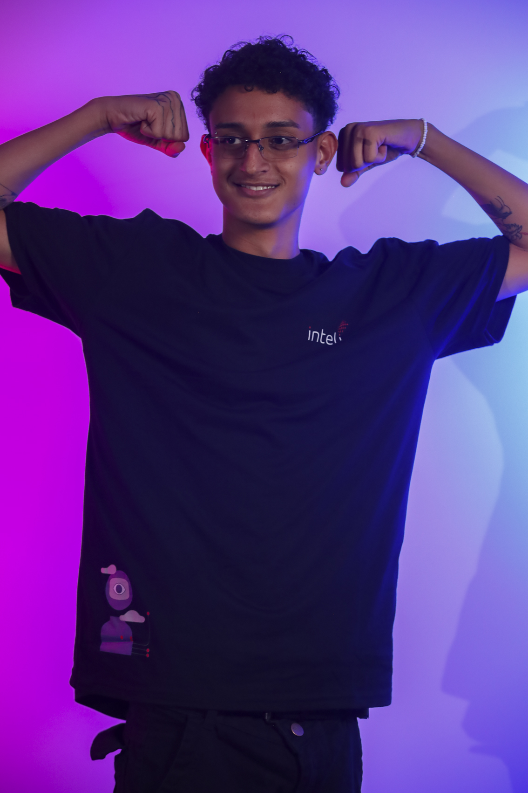

# Inteli - Instituto de Tecnologia e Liderança 

# Celso Caminhões 🚛

## PlayVC

## Integrantes

  <table>
    <tr>
      <td align="center"><a href="https://www.linkedin.com/in/victor-marques-profile/"> <b>Victor M.</b></a></td>
      <td align="center"><a href="https://www.linkedin.com/in/gabriel-farias-alves/"> <b> Gabriel F.</b></a></td>
      <td align="center"><a href="https://www.linkedin.com/in/rafael-coutinho2004/"> <b>Rafael C.</b></a></td>
      <td align="center"><a href="https://www.linkedin.com/in/henrique-ottoboni-magalh%C3%A3es-77b950264/"> <b>Henrique O.</b></a></td>
    </tr>
  </table>

  <table>
    <tr>
    <td align="center"><a href="https://www.linkedin.com/in/davi-arantes-308949264/"> <b>Davi A.</b></a></td>
      <td align="center"><a href="https://www.linkedin.com/in/jo%C3%A3o-paulo-santos-872753264/"> <b>João S.</b></a></td>
      <td align="center"><a href="https://www.linkedin.com/in/caio-kakunaka-235754264"> <b>Caio E.</b></a></td>
    </tr>
  </table>

## Descrição

> 📜 O jogo "Celso Caminhões" foi desenvolvido no módulo 1 da turma de 2023.1 do Inteli - Instituto de Tecnologia e Liderança, pela equipe PlayVC. Sem pormenorizar, o projeto visa demonstrar, sobretudo aos motoristas que transportam os produtos do parceiro (Grupo Unipar), a importância das boas atitudes antes e durante a viagem de caminhão, de modo a enfatizar que o processo da direção de um veículo começa antes mesmo do motorista sair de casa.

  
  Celso Caminhões by PlayVC

Sob essa perspectiva, este jogo trata-se de um *Serious Game* que visa a conscientização dos usuários acerca das consequências das "pequenas" decisões diárias, como comer bem, por exemplo. Destarte, o jogo "Celso Caminhões", de maneira lúdica e intuitiva, disponibiliza ao usuário uma série de interações, em um cenário que simula a casa do jogador, para depois mostrar os efeitos dessas deciões na jogabilidade da fase final (*run game*). Sendo assim, a equipe procurou mostrar aos motoristas que, assim como no jogo, é necessário tomar atitudes conscientes antes mesmo de sair de casa, haja vista que elas impactam diretamente na direção do caminhão.

Além da finalidade educativa, o jogo foi desenvolvido considerando importantes questões sociais, como a inclusão de gênero e de raça e a acessibilidade - tanto digital, no sentido técnico, quanto informacional, no sentido da complexidade dos diálogos do jogo. Sendo assim, com o intuito de incluir o maior número de pessoas possível, os desenvolvedores criaram o conceito de **Celsoverso**, que, em linhas gerais, trata-se de um multiverso de Celsos (protagonista do jogo). Com essa atitute, foi possível criar personagens com raças, gêneros e características singulares, garantindo a identificação do jogador com o personagem principal.

Ademais, com o intuito de garantir uma maior imersão no jogo, a equipe PlayVC prezou por criar outro elemento totalmente novo nos jogos do Inteli (além do Celsoverso): a possibilidade de seleção do estilo musical tocado durante toda a gameplay. Tal ação objetiva a garantia de uma experiência significativa ao jogador, já que, assim como ele pode fazer na vida real através de um rádio, é possível selecionar o estilo musical que mais lhe agrada.

May the force be with you!

## 🛠 Estrutura de pastas

-Raiz 
|-->docs 
|-->documentos 
  &emsp;|-->antigos 
  &emsp;|GDD.docx e GDD.pdf 
|-->executáveis 
  &emsp;|-->windows 
  &emsp;|-->android 
  &emsp;|-->HTML 
|-->imagens 
|-->src 
|readme.md 

A pasta raiz contém um arquivo principal:

<b>README.MD</b>: Arquivo que serve como guia e explicação geral sobre o projeto. O mesmo que você está lendo agora.

Há também 5 pastas que seguem da seguinte forma:

<b>docs</b>: Local onde ficam os arquivos compilados em HTML do jogo.

<b>documentos</b>: Aqui ficam todos os documentos do projeto, mas principalmente o <b>GDD (Game Design Document)/Documentação do Sistema</b>. Há uma pasta <b>antigos</b> onde estão todas as versões antigas da documentação.

<b>executáveis</b>: Aqui ficam todos os executáveis do jogo, prontos para rodar. Há no mínimo 3 pastas, uma para binários <b>Windows</b>, uma para binários <b>android</b> e uma para a <b>Web/HTML</b>

<b>imagens</b>: Algumas imagens do jogo/sistema e logos prontos para serem utilizados e visualizados.

<b>src</b>: Nesta pasta fica todo o código fonte do jogo/sistema, pronto para para ser baixado e modificado.

## 🛠 Instalação

<b>Android:</b>

Como um grande diferencial e destaque dos jogos desenvolvidos pelas turmas do Inteli, o "Celso Caminhões" está disponível para, além do sistema operacional Windows, celulares com sistema operacional Android. Nesse sentido, para instalar o aplicativo basta baixar o apk na pasta executáveis e, em seguida, seguir os procedimentos de instalação disponíveis nesta pasta.

<b>Windows:</b>

Não há instalação! Apenas executável!
Encontre o JOGO.exe na pasta executáveis e execute-o como qualquer outro programa.

<b>HTML:</b>

Não há instalação!
Encontre o index.html na pasta executáveis e execute-o como uma página WEB (através de algum browser).

## 💻 Configuração para Desenvolvimento

1 - Faça o download do GODOT e deste repositório.
2 - Abra o GODOT, ao ser prontificado clique em IMPORTAR.
3 - Selecione a pasta onde descompactou este repositório.

Para abrir este projeto você necessita das seguintes ferramentas:

-<a href="https://godotengine.org/download">GODOT</a>

## 🗃 Histórico de lançamentos

A cada atualização os detalhes são lançados aqui.
* 1.0.0 - 05/04/2023
    * **Primeira versão (MAJOR) do jogo, com todas as funcionalidades planejadas implementadas**.
    * Primeira versão jogável do **Celso Caminhões Pocket Edition** para Android;
    * Refatoração dos scripts com base em *Clean Code* e boas práticas de programação;
    * Adição de 2 novos personagens na tela de seleção;
    * Finalização do Game Design Document.
* 0.9.0 - 02/04/2023
    * Tradução do jogo para espanhol;
    * Adição do sistema de diminuição de energia;
    * Sinalização das interações no mapa da casa;
    * Sistema de rádio no run game;
    * Melhora sprite da pontuação;
    * Adiciona zoom no personagem.
* 0.8.0 - 28/03/2023
    * Melhoria do run game - jogabilidade, background e spawn dos inimigos;
    * Tradução do jogo para inglês;
    * Correção da tela inicial de pause;
    * Incrementa o tutorial do jogo.
* 0.7.0 - 24/03/2023
    * Finalização do Minigame de checklist;
    * Interações na cena do tutorial;
    * Debuff de celular com notificação ativada;
    * Criação de cutscenes;
    * Criação da tela de pause;
    * Randomização da cor dos carros no RunGame;
    * Obstáculos (cones, pneus e árvores) na pista da direita do RunGame;
    * Criação e implantação de novos Celsos (Celsoverso);
    * Início do desenvolvimento da solução para Android.
* 0.6.1 - 21/03/2023
    * Cena do RunGame;
    * Diálogos das interações;
    * Melhoria das interações - layout e programação;
    * Transição de cena da casa para o minigame; 
    * Debuff de controle trocado;
    * Criação e implantação de novos Celsos (Celsoverso).
* 0.5.0 - 16/03/2023
    * Interação básica com as partes da casa;
    * Desenvolvimento da mecânica básica do minigame do checklist;
    * Criação e implantação de novos Celsos (Celsoverso);
* 0.4.0 - 13/03/2023
    * Seleção de personagens (tela de seleção e spritesheets).
* 0.3.0 - 10/03/2023
    * Remodelação das telas de menu inicial e menu de configurações;
    * Adição de funcionalidades à tela de configurações - controle do volume da música, seleção de estilo musical favorito, seleção de idioma, informações sobre os controles do jogo e configurações de tela cheia;
    * Tela de tutorial interativa;
    * Finalização e implantação do personagem principal - Celso;
    * Criação dos diálogos do jogo em português, inglês e espanhol;
    * Criação do primeiro minigame com diálogos, cronômetro e tutorial;
    * Desenvolvimento da HUD com a barra de energia e a pontuação do jogador;
    * Atualização do GDD com os testes iniciais.
* 0.2.1 - 24/02/2023
    * Criação de dois novos mapas (visão externa e interna da casa), criação da primeira tela do menu de opções e adição dos botões de crédito e de opções no menu inicial;
    * Correção do GDD.
* 0.1.0 - 10/02/2023
    * Lançamento da primeira versão (artefato) -> mecânica básica de movimentação, câmera e sons

## 📋 Licença/License

<a property="dct:title" rel="cc:attributionURL" href="https://github.com/Spidus/Teste_Final_1">MODELO GIT INTELI</a> by <a rel="cc:attributionURL dct:creator" property="cc:attributionName" href="https://www.yggbrasil.com.br/vr">INTELI, VICTOR BRUNO ALEXANDER ROSETTI DE QUIROZ</a> is licensed under <a href="http://creativecommons.org/licenses/by/4.0/?ref=chooser-v1" target="_blank" rel="license noopener noreferrer" style="display:inline-block;">Attribution 4.0 International</a>

## 🎓 Referências & Créditos

> 🤖 [Documentação do Godot](https://docs.godotengine.org/pt_BR/latest/about/index.html)  
🏠 [Modern Exteriors](https://limezu.itch.io/moderninteriors) e [Modern Interiors](https://limezu.itch.io/moderninteriors)  
📻 [Forró](https://www.youtube.com/watch?v=IGgg8PajPN8), [Samba](https://www.youtube.com/watch?v=CoAP1ZjOD_Q), [Sertanejo](https://www.youtube.com/watch?v=9MoDQTe10vs) e [Rock](https://www.youtube.com/watch?v=fh-o8Bxc3Ys)
